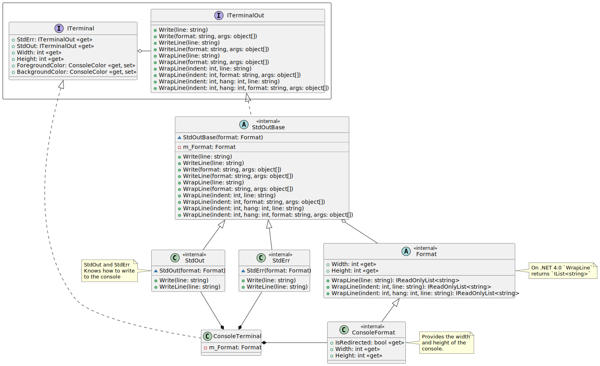
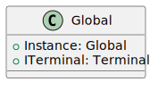
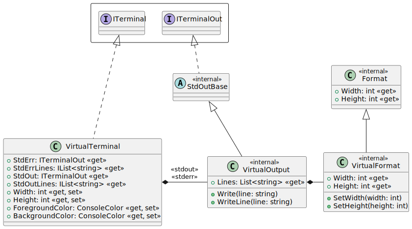

# Design for Terminal Classes <!-- omit in toc -->

- [1. Design Goals](#1-design-goals)
  - [1.1. RJCP Code](#11-rjcp-code)
- [2. Class Diagrams for Terminal](#2-class-diagrams-for-terminal)
  - [2.1. Terminal and ConsoleTerminal](#21-terminal-and-consoleterminal)
  - [2.2. The `ITerminal.WrapLine` functions](#22-the-iterminalwrapline-functions)
    - [2.2.1. Normal Lines to be Wrapped](#221-normal-lines-to-be-wrapped)
    - [2.2.2. Hanging Indents on Wrapped Lines](#222-hanging-indents-on-wrapped-lines)
    - [2.2.3. Indents for Wrapped Lines](#223-indents-for-wrapped-lines)
- [3. Dependency Injection](#3-dependency-injection)
  - [3.1. Traditional Applications](#31-traditional-applications)
  - [3.2. Hosted Applications](#32-hosted-applications)
- [4. Testing](#4-testing)
  - [4.1. Class Diagrams](#41-class-diagrams)

## 1. Design Goals

To implement an `ITerminal` interface, which code can use to write to the
console, and not care where it is actually written to. The `ConsoleTerminal`
implementation could write to the current console. A `VirtualTerminal` could
write to a memory buffer that test cases can check outputs.

One could decide to implement very advanced output to a serial port, or to the
network, although that is out of the scope of this implementation.

### 1.1. RJCP Code

The code in my libraries write to the console, especially for help and reporting
information. The lines that are written need to be:

- Automatically wrapped based on the current console in use
- Tested, that we know if there was something written to the console.

## 2. Class Diagrams for Terminal

### 2.1. Terminal and ConsoleTerminal

The interface is `ITerminal`. The interface is very useful when testing code
that writes to the terminal. Using the factory pattern and dependency injection,
code can change the terminal behaviour, or provide a virtual terminal for
testing.



The `WrapLine` method takes the current width, and wraps the text, with the
given indenting, into the console. This is the method that is mostly helpful
when printing help information.

The default `indent` is `0`. The `hang` is relative to `indent` and can be
negative, so that the default `hang` is `0`.

### 2.2. The `ITerminal.WrapLine` functions

The `WrapLine` functions take the final string and breaks it up into words,
which are then placed until they would exceed the line length.

It is treated that if there are no spaces at the beginning of the line, the
`indent` is used. If there are spaces at the beginning of the line or this is
the second (or later) line, the `hang` indent is used.

#### 2.2.1. Normal Lines to be Wrapped

If a line, such as normal information needs to be printed, then use
`WrapLine(line: string)` without any indent information

> Program {0}. This program is (C) by Blah Blah, 2024. It is licensed under the
> MIT, for more information, see `LICENSE.md`.

```text
Program Prog.exe. This program is (C) by Blah Blah,
2024. It is licensed under the MIT, for more
information, see `LICENSE.md`.
```

#### 2.2.2. Hanging Indents on Wrapped Lines

For example, the following line would use `indent = 0` and `hang = 2`.

> \* This is a long line. If it extends over to the next line it should have a
> hanging indent (e.g. of 2)

```text
* This is a long. If it extends over to the next
  line it should have a hanging indent (e.g. of 2)
```

And command line options, which is split over two lines, would have the second
line start with a blank to indicate using the hanging indent imediately.

> {0}v | {1}verbosity{2}value
> &blank;Show the verbosity

```text
-v | --verbosity=value
  Show the verbosity
```

#### 2.2.3. Indents for Wrapped Lines

The indents are often used for paragraphs after a hanging indent.

> The verbosity has values from 1 to 5. Any value of the verbosity greater than 5 has no effect.

Let's imagine that this was printed with an `indent = 2` and `hang = 0`, which
is after the line in the previous section. So the first paragraph is from the
first function with `indent = 0` and `hang = 2`, the secnd is with `indent = 2`
and `hang = 0`.

```text
* This is a long. If it extends over to the next
  line it should have a hanging indent (e.g. of 2)

  The verbosity has values from 1 to 5. Any value
  of the verbosity greater than 5 has no effect.
```

## 3. Dependency Injection

The `ITerminal` can be used for the factory pattern, such as in the diagram
below, or use some other injection mechanism, e.g. as with .NET Core application
host.

### 3.1. Traditional Applications

Traditional applications would generally have a `Global` class and define their
singletons there, and allow test cases to configure the singletons on startup.



### 3.2. Hosted Applications

Or the [.NET Generic
Host](https://learn.microsoft.com/en-us/dotnet/core/extensions/generic-host?tabs=appbuilder)
could be used, and initialise as:

```csharp
namespace RJCP.TestHostApp
{
    using System.Threading.Tasks;
    using Microsoft.Extensions.DependencyInjection;
    using Microsoft.Extensions.Hosting;
    using Microsoft.Extensions.Logging;

    public static class Program
    {
        public static async Task<int> Main(string[] args)
        {
            var host = Host.CreateDefaultBuilder(args)
                .ConfigureServices(services => {
                    services.AddTransient<MyService>();
                    services.AddSingleton<ITerminal, Terminal>();
                })
                .ConfigureLogging(builder => {
                    builder.ClearProviders();
                    builder.AddConsole();
                })
                .Build();
            var my = host.Services.GetRequiredService<MyService>();
            return await my.ExecuteAsync();
        }
    }
}

namespace RJCP.TestHostApp
{
    using System.Threading;
    using System.Threading.Tasks;
    using Microsoft.Extensions.DependencyInjection;
    using Microsoft.Extensions.Hosting;
    using Microsoft.Extensions.Logging;

    internal class MyService
    {
        private readonly ILogger<MyService> _logger;
        private readonly ITerminal _terminal;

        public MyService(ILogger<MyService> logger, ITerminal terminal)
        {
            _logger = logger;
            _terminal = terminal;
        }

        public async Task<int> ExecuteAsync(CancellationToken stoppingToken = default)
        {
            _logger.LogInformation("Doing something");
            _terminal.WriteLine("This is a terminal line");
            return 0;
        }
    }
}
```

Using dependency injection, testing classes wouldn't use any singletons, but
instantiate the test object and inject into the constructor of objects being
tested.

## 4. Testing

There should be a second implementation of the `ITerminal` interface. Test code
would instantiate this implementation to test that code is properly written.

### 4.1. Class Diagrams

To test, the following code should be provided (into the RJCP assembly).



The virtual console should not wrap (equivalent to an infinitely long lines,
which makes it easier to test). Indents should be honoured. Hanging indents
depend on the newlines in the message that needs formatting.
